# F1 Pitwall Simulator Hosted Workshop


In this workshop, you take on the role of a pit crew for the River Racing F1 team. Starting with just car telemetry data and live race standings, you'll turn that raw data into actionable insights and anomaly monitoring to help your driver make optimal pit decisions. By the end of the workshop, you'll understand how Confluent Intelligence brings together streaming agents, built-in AI functions, and Real-Time Context Engine (RTCE) to power valuable insights on real-time streaming data. 

## Setup

1. Run the following setup commands based on your operating system. 

    <details>
    <summary>for Mac</summary>

    ```bash
    brew install git uv
    brew install --cask claude-code   # optional — only for the Bonus section
    ```

    </details>

    <details>
    <summary>for Windows</summary>

    ```powershell
    winget install --id Git.Git -e
    winget install --id astral-sh.uv -e
    winget install --id Anthropic.ClaudeCode -e
    ```

    Close and reopen the terminal afterward so the new tools are on your `PATH`.

    </details>

2. Clone the repository and install the dependencies:

    ```bash
    git clone https://github.com/confluentinc/demo-confluent-intelligence-f1.git
    cd demo-confluent-intelligence-f1
    uv venv
    uv sync
    ```

## Lab 1 — Open Your Environment

### 1. Get your credentials

1. Follow the link from your instructor to claim your workshop credentials. 

2. In your terminal, in the `demo-confluent-intelligence-f1` folder, create the `credentials.env` file:

    ```bash
    nano credentials.env
    ```
3. Paste the entire `Env File` block you received from your instructor into it. Then save and exit: in `nano`, press **Ctrl-O**, then **Enter**, then **Ctrl-X**.

    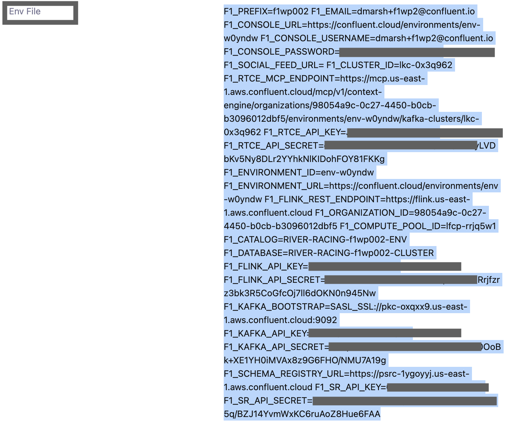

    > [!NOTE]
    > The pasted lines will collapse onto a single line — this happens in any editor. That's fine — save and exit as normal.

4. Now, you can start the dashboard:

    ```bash
    uv run f1-pitwall
    ```

A browser opens at **http://localhost:8000**.

> [!WARNING]
> **Leave this terminal tab and the browser tab open for the entire workshop.** The dashboard only runs while `uv run f1-pitwall` keeps running — closing the terminal, stopping the command, or closing the browser tab stops the dashboard.

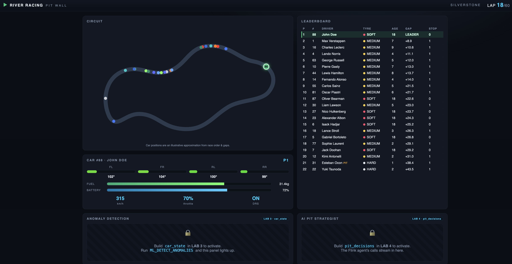

> [!NOTE]
> The **Anomaly Detection** and **AI Pit Strategist** panels start locked. They unlock as you complete the next two labs — Lab 3 (`car_state`) and Lab 4 (`pit_decisions`).

### 2. Open a SQL workspace

1. **If you're logged in to a Confluent Cloud account already, log out now.** Open [confluent.cloud](https://confluent.cloud/) and log in with the **Console Username** and **Console Password** provided from the dispenser. Note, this is not your personal Confluent Cloud Account. 

2. You'll land in your environment, **`RIVER-RACING-f1wp###-ENV`**.

    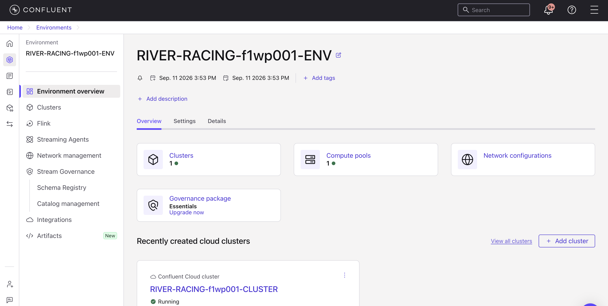

3. Open the **Flink** tab and click **SQL workspace**.

    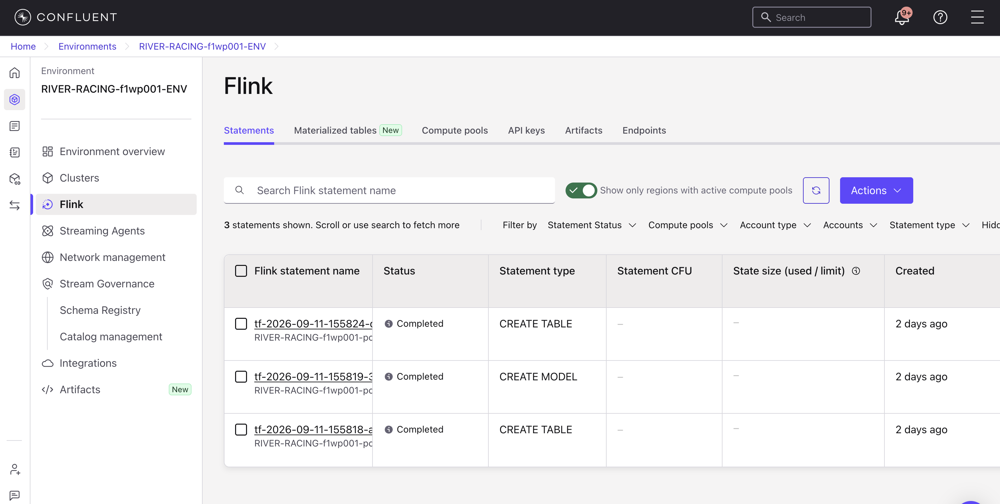

    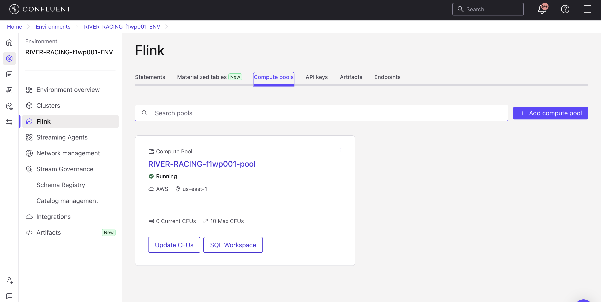

4. Set the workspace's **catalog** to your environment and **database** to your cluster (`RIVER-RACING-f1wp###-CLUSTER`), using the dropdowns above the editor.

    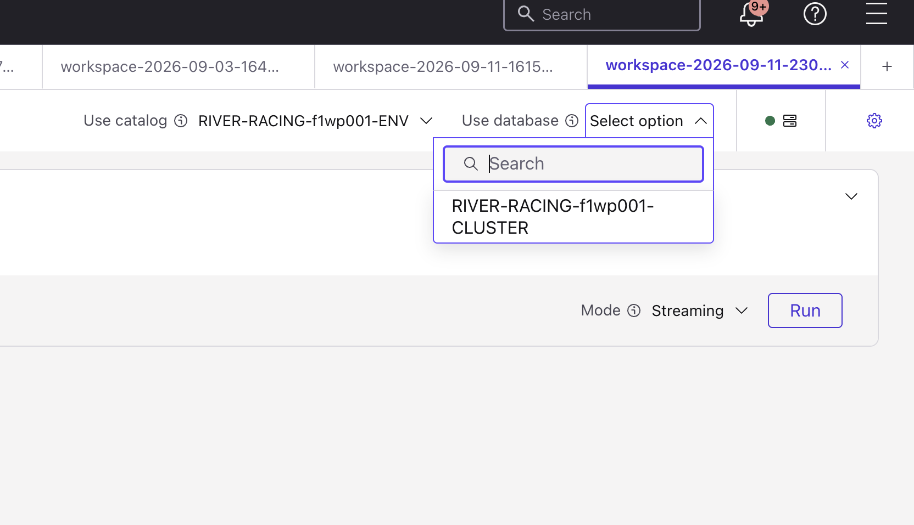

## Lab 2 — Explore the Environment

Let's get familiar with the topics and data available in the environment. 

1. First, inspect the source tables:

    ```sql
    SHOW TABLES;
    ```

    | Table | Source | Format |
    |-------|--------|--------|
    | `car_telemetry` | Race simulator — car #88 sensors, ~5 readings/lap | Avro |
    | `race_standings` | Race simulator — all 22 cars, keyed by `car_number` (upsert) | Avro |
    | `driver_race_history` | CDC from the shared Postgres (198 historical rows) | JSON |

2. Check the telemetry stream:

    ```sql
    SELECT car_number, lap, tire_temp_fl_c, tire_pressure_fl_psi, engine_temp_c
    FROM car_telemetry;
    ```

    Stop that query after you see rows. 

3. Check the race standings:

    ```sql
    SELECT car_number, `position`, gap_to_leader_sec, tire_compound, tire_age_laps
    FROM race_standings;
    ```

## Lab 3 — Stream Processing: Enrichment + Anomaly Detection

1. Stop every streaming `SELECT` from Lab 2. Then paste this entire statement into one SQL cell and run it:

    ```sql
    CREATE TABLE `car_state`
    WITH ('changelog.mode' = 'append')
    AS
    WITH enriched AS (
      SELECT
        t.car_number, t.event_time, t.lap,
        t.tire_temp_fl_c, t.tire_temp_fr_c, t.tire_temp_rl_c, t.tire_temp_rr_c,
        t.tire_pressure_fl_psi, t.tire_pressure_fr_psi,
        t.tire_pressure_rl_psi, t.tire_pressure_rr_psi,
        t.engine_temp_c, t.brake_temp_fl_c, t.brake_temp_fr_c,
        t.battery_charge_pct, t.fuel_remaining_kg,
        r.`position`, r.gap_to_ahead_sec, r.gap_to_leader_sec,
        r.pit_stops, r.tire_compound, r.tire_age_laps
      FROM `car_telemetry` t
      JOIN `race_standings` FOR SYSTEM_TIME AS OF t.event_time AS r
        ON t.car_number = r.car_number
    ),
    windowed AS (
      SELECT
        window_start, window_end, window_time, car_number,
        MAX(lap) AS lap,
        AVG(tire_temp_fl_c) AS tire_temp_fl_c,
        AVG(tire_temp_fr_c) AS tire_temp_fr_c,
        AVG(tire_temp_rl_c) AS tire_temp_rl_c,
        AVG(tire_temp_rr_c) AS tire_temp_rr_c,
        AVG(tire_pressure_fl_psi) AS tire_pressure_fl_psi,
        AVG(tire_pressure_fr_psi) AS tire_pressure_fr_psi,
        AVG(tire_pressure_rl_psi) AS tire_pressure_rl_psi,
        AVG(tire_pressure_rr_psi) AS tire_pressure_rr_psi,
        AVG(engine_temp_c) AS engine_temp_c,
        AVG(brake_temp_fl_c) AS brake_temp_fl_c,
        AVG(brake_temp_fr_c) AS brake_temp_fr_c,
        AVG(battery_charge_pct) AS battery_charge_pct,
        AVG(fuel_remaining_kg) AS fuel_remaining_kg,
        MAX(`position`) AS `position`,
        MAX(gap_to_ahead_sec) AS gap_to_ahead_sec,
        MAX(gap_to_leader_sec) AS gap_to_leader_sec,
        MAX(pit_stops) AS pit_stops,
        MAX(tire_compound) AS tire_compound,
        MAX(tire_age_laps) AS tire_age_laps
      FROM TABLE(
        TUMBLE(TABLE enriched, DESCRIPTOR(event_time), INTERVAL '20' SECOND)
      )
      GROUP BY window_start, window_end, window_time, car_number
    ),
    anomaly AS (
      SELECT
        *,
        ML_DETECT_ANOMALIES(tire_temp_fl_c, window_time,
          JSON_OBJECT('minTrainingSize' VALUE 12,
                      'maxTrainingSize' VALUE 50,
                      'confidencePercentage' VALUE 99.99,
                      'enableStl' VALUE FALSE))
          OVER (PARTITION BY car_number ORDER BY window_time RANGE BETWEEN UNBOUNDED PRECEDING AND CURRENT ROW)
          AS anomaly_tire_temp_fl_result
      FROM windowed
    )
    SELECT
      car_number, lap,
      tire_temp_fl_c, tire_temp_fr_c, tire_temp_rl_c, tire_temp_rr_c,
      tire_pressure_fl_psi, tire_pressure_fr_psi,
      tire_pressure_rl_psi, tire_pressure_rr_psi,
      engine_temp_c, brake_temp_fl_c, brake_temp_fr_c,
      battery_charge_pct, fuel_remaining_kg,
      CASE
        WHEN anomaly_tire_temp_fl_result.is_anomaly
            AND anomaly_tire_temp_fl_result.actual_value
                > anomaly_tire_temp_fl_result.upper_bound
        THEN true
        ELSE false
      END AS anomaly_tire_temp_fl,
      `position`, gap_to_ahead_sec, gap_to_leader_sec,
      pit_stops, tire_compound, tire_age_laps
    FROM anomaly
    WHERE lap > 0;
    ```

> [!WARNING]
> This cell must keep running for the whole workshop. Don't stop it.

2. Verify the output in a new cell:

    ```sql
    SELECT car_number, lap, `position`, tire_compound, tire_age_laps,
          anomaly_tire_temp_fl, tire_temp_fl_c
    FROM `car_state`;
    ```

    You should see one row per 20-second lap. At lap 24, `anomaly_tire_temp_fl` becomes `true` and the temperature reaches about 145°C.

<details>
<summary>Optional: Forecast tire temperature with new IBM Granite Time Series Models</summary>

1. Open a new SQL cell and run the query below. It uses the same 20-second, one-per-lap tire temperature windows, but asks the built-in `AI_FORECAST` function for the next 20 values. The query uses the IBM Granite TinyTimeMixer model built directly into Confluent Cloud. 

    ```sql
    WITH windowed AS (
      SELECT
        window_start,
        window_end,
        window_time,
        car_number,
        MAX(lap) AS lap,
        AVG(tire_temp_fl_c) AS tire_temp_fl_c
      FROM TABLE(
        TUMBLE(TABLE `car_telemetry`, DESCRIPTOR(event_time), INTERVAL '20' SECOND)
      )
      GROUP BY window_start, window_end, window_time, car_number
    ),
    forecasted AS (
      SELECT
        *,
        AI_FORECAST(
          tire_temp_fl_c,
          window_time,
          JSON_OBJECT(
            'model' VALUE 'ttm',
            'horizon' VALUE 20,
            'minContextSize' VALUE 20,
            'maxContextSize' VALUE 50,
            'rmseWindowSize' VALUE 5
          )
        ) OVER (
          PARTITION BY car_number
          ORDER BY window_time
          RANGE BETWEEN UNBOUNDED PRECEDING AND CURRENT ROW
        ) AS forecast_result
      FROM windowed
    )
    SELECT
      lap,
      window_time AS forecast_generated_at,
      tire_temp_fl_c AS current_tire_temperature_c,
      forecast_result.forecast[1].`timestamp` AS next_point_at,
      forecast_result.forecast[1].mean AS next_point_c,
      forecast_result.forecast AS full_forecast,
      forecast_result.metadata AS forecast_metadata
    FROM forecasted
    WHERE CARDINALITY(forecast_result.forecast) > 0;
    ```

2. Stop this optional query after you see results so Lab 4 can use the compute pool.

</details>

## Lab 4 — Streaming Agent: Pit Decisions

Now we'll create a Flink streaming agent that reads `car_state` and asks an LLM for a pit-stop recommendation on every lap.

Create the streaming agent in a new SQL cell:

```sql
CREATE AGENT `pit_strategy_agent`
USING MODEL `llm_textgen_model`
USING PROMPT 'OUTPUT FORMAT — respond with exactly these 7 labeled lines in this order. No markdown, no asterisks, no bold, plain text only.

Suggestion: [PIT NOW | PIT SOON | STAY OUT]
Condition Summary: [one sentence describing current car condition]
Race Context: [one sentence on race situation based on competitor standings in the input]
Recommended Compound: [SOFT | MEDIUM | HARD | N/A if STAY OUT]
Recommended Stint Laps: [integer expected laps on new tires | N/A if STAY OUT]
Recommended Reason: [one sentence explaining compound choice | N/A if STAY OUT]
Reasoning: [2-4 sentences full explanation of your decision]

Correct STAY OUT example:
Suggestion: STAY OUT
Condition Summary: Front-left tire temperature is nominal at 107C with 18 laps of age on SOFT compound.
Race Context: Currently P3. No competitors in top 10 have pitted yet. Leader is 8.2s ahead.
Recommended Compound: N/A
Recommended Stint Laps: N/A
Recommended Reason: N/A
Reasoning: Tire temps and pressures are within normal operating windows for a SOFT at this age. Track position P3 is strong. Pitting now would surrender 4-6 seconds and drop John behind cars currently behind us.

Correct PIT NOW example:
Suggestion: PIT NOW
Condition Summary: Front-left tire temperature anomaly at 145C, 20C above expected upper bound — failure risk imminent.
Race Context: Currently P8. P4 and P5 already pitted 3 laps ago and are pushing on fresh mediums.
Recommended Compound: MEDIUM
Recommended Stint Laps: 36
Recommended Reason: Mediums will carry John to the flag across the remaining 36 laps and give him the pace to recover positions lost during the stop.
Reasoning: The FL anomaly flag indicates the SOFT has gone past its operating limit with blowout risk. Pitting now onto mediums avoids tire failure. Based on historical data, John averages +2.75 positions on SOFT-MEDIUM — this is his strongest strategy.

---

You are the AI pit wall strategist for River Racing at the 2026 British Grand Prix (Silverstone, 60 laps).
Driver: John Doe, Car #88.

DECISION FRAMEWORK — use this priority order to reason about the Suggestion.
This is guidance for judgment, not a rule to execute mechanically.

PIT NOW vs PIT SOON — these mean different things and are not interchangeable
labels for "pit now would be reasonable." PIT NOW means urgent: a validated
problem exists and the car should come in immediately for safety. PIT SOON
means strategic: the tires are aging into their normal pit window and a stop
is coming, even if stopping on this exact lap would itself be the sound
strategic choice. A strategy-driven stop stays PIT SOON for its entire
window; it does not become PIT NOW just because the ideal moment has arrived.

1. Anomaly signal: anomaly_tire_temp_fl comes from a trained statistical anomaly
   detector (ML_DETECT_ANOMALIES) that has already evaluated tire_temp_fl_c
   against expected bounds for this car at this point in the race. PIT NOW is
   reserved for this signal being true — treat it as strong, validated evidence
   of a real tire problem serious enough to justify an urgent stop. When it is
   false, there is no statistical evidence of a problem: a raw temperature
   reading that merely looks high to you has already been checked and found
   within the expected range for this stage of the stint, so weigh that check
   heavily before treating anything as urgent on the strength of a number alone.
   Nothing else in this input — not tire age, not race context, not competitor
   behavior — should produce PIT NOW; those inform PIT SOON or STAY OUT instead.
2. Pit history: a car that has already pitted this race is usually better off
   staying out and running its current tires to the end, absent a new problem.
3. Tire age and compound: a SOFT tire that has run past roughly 20 laps starts
   trending into a strategic pit window. This is PIT SOON, not PIT NOW, for as
   long as that window lasts — even on the lap where pitting would be ideal —
   since pace typically falls off after that point but there is no validated
   safety issue driving urgency.
4. Otherwise: STAY OUT is the reasonable default when nothing above points to a
   reason to change strategy.

Weigh these in order of severity, and keep the PIT NOW/PIT SOON distinction
above intact regardless of how you weigh them — you are reasoning about a race
strategy call, not executing a lookup table, but the two labels still mean
different things. Use the TIRE DATA, RACE CONTEXT, and COMPETITOR CONTEXT
below to inform your Reasoning field regardless of which Suggestion you land on.

Correct STAY OUT despite a high-looking temperature example:
Suggestion: STAY OUT
Condition Summary: Front-left tire temperature reads 118C, which may look elevated, but the anomaly detector has not flagged it as unusual for this stage of the tire life.
Race Context: Currently P5. Field is spread out, no pit activity nearby.
Recommended Compound: N/A
Recommended Stint Laps: N/A
Recommended Reason: N/A
Reasoning: No anomaly has been detected, so there is no validated evidence of a tire problem despite the reading looking high in isolation. Pit stops are at zero and tire age is still well under the strategic pit window, so there is no other reason to come in. Staying out preserves track position.

STRICT OUTPUT VALUES — the Suggestion field must be exactly one of these three
literal strings, with no other characters, punctuation, or words on that line:
PIT NOW
PIT SOON
STAY OUT
No variants, synonyms, qualifiers, or explanatory text are permitted on the
Suggestion line (e.g. never "PIT NOW - tire failure risk" or "Stay out for now").
Downstream systems match this field with exact string equality.

SELF-CHECK before responding: re-read your Suggestion against the TIRE DATA and
RACE CONTEXT above and confirm your Reasoning genuinely explains it. If the
Reasoning and the Suggestion disagree with each other, fix whichever one is
actually wrong.

COMPETITOR CONTEXT:
Current top-10 standings are provided at the end of each input. Use them to identify:
- Which competitors have already pitted (and are now on fresher rubber)
- Who is still on old tires and likely to pit soon
- Whether John is at risk of being undercut, or has an overcut opportunity

TIRE STRATEGY at Silverstone (60-lap race):
- SOFT: High-grip compound. Optimal window is laps 1-19. Still competitive laps 20-22 with some pace loss and position drops — but no failure risk unless the anomaly sensor fires. Performance cliff begins around lap 18-20.
- MEDIUM: Balanced compound, best for a 30-40 lap second stint after a SOFT first stint. Enables clean 1-stop strategy.
- HARD: Very durable but slow. Only consider if 40+ laps remain at the second stop.
- John Doe historical best: SOFT first stint → MEDIUM second stint (1-stop) averages +2.75 positions over 4 prior races. The pit wall warns at laps 21-23, calls PIT NOW only when the lap-24 anomaly fires, then lets the fresh MEDIUM stint run.

REMINDER: For any STAY OUT decision, write N/A for Recommended Compound, Recommended Stint Laps, and Recommended Reason.'
WITH ('max_iterations' = '10');
```

Confirm it was created successfully:

```sql
SHOW AGENTS;
```

Create `pit_decisions`, which invokes `AI_RUN_AGENT` and puts our agent to work:

```sql
CREATE TABLE `pit_decisions`
WITH ('changelog.mode' = 'append')
AS
SELECT
  cs.car_number,
  cs.lap,
  cs.`position`,
  cs.tire_compound AS tire_compound_current,
  cs.tire_age_laps,
  cs.anomaly_tire_temp_fl,
  TRIM(REGEXP_EXTRACT(CAST(response AS STRING), '\*{0,2}Suggestion:\*{0,2}\s*([^\n]+)', 1)) AS suggestion,
  TRIM(REGEXP_EXTRACT(CAST(response AS STRING), '\*{0,2}Condition Summary:\*{0,2}\s*([^\n]+)', 1)) AS condition_summary,
  TRIM(REGEXP_EXTRACT(CAST(response AS STRING), '\*{0,2}Race Context:\*{0,2}\s*([^\n]+)', 1)) AS race_context,
  NULLIF(TRIM(REGEXP_EXTRACT(CAST(response AS STRING), '\*{0,2}Recommended Compound:\*{0,2}\s*([^\n]+)', 1)), 'N/A') AS recommended_tire_compound,
  CAST(NULLIF(TRIM(REGEXP_EXTRACT(CAST(response AS STRING), '\*{0,2}Recommended Stint Laps:\*{0,2}\s*([^\n]+)', 1)), 'N/A') AS INT) AS recommended_stint_laps,
  NULLIF(TRIM(REGEXP_EXTRACT(CAST(response AS STRING), '\*{0,2}Recommended Reason:\*{0,2}\s*([^\n]+)', 1)), 'N/A') AS recommended_reason,
  TRIM(REGEXP_EXTRACT(CAST(response AS STRING), '\*{0,2}Reasoning:\*{0,2}\s*([\s\S]+?)$', 1)) AS reasoning,
  CAST(response AS STRING) AS raw_response
FROM `car_state` /*+ OPTIONS('scan.startup.mode'='earliest-offset') */ cs,
LATERAL TABLE(AI_RUN_AGENT(
  `pit_strategy_agent`,
  CONCAT(
    'CAR STATE — Lap ', CAST(cs.lap AS STRING), ' of 60 | Silverstone British Grand Prix\n',
    'Driver: John Doe (#', CAST(cs.car_number AS STRING), ') | Current Position: P', CAST(cs.`position` AS STRING), '\n',
    '\nTIRE DATA:\n',
    '  Compound: ', cs.tire_compound, ' | Age: ', CAST(cs.tire_age_laps AS STRING), ' laps\n',
    '  FL Temp: ', CAST(ROUND(cs.tire_temp_fl_c, 1) AS STRING), 'C',
    '  FR: ', CAST(ROUND(cs.tire_temp_fr_c, 1) AS STRING), 'C',
    '  RL: ', CAST(ROUND(cs.tire_temp_rl_c, 1) AS STRING), 'C',
    '  RR: ', CAST(ROUND(cs.tire_temp_rr_c, 1) AS STRING), 'C\n',
    '  FL Pressure: ', CAST(ROUND(cs.tire_pressure_fl_psi, 1) AS STRING), 'psi',
    '  FR: ', CAST(ROUND(cs.tire_pressure_fr_psi, 1) AS STRING), 'psi',
    '  RL: ', CAST(ROUND(cs.tire_pressure_rl_psi, 1) AS STRING), 'psi',
    '  RR: ', CAST(ROUND(cs.tire_pressure_rr_psi, 1) AS STRING), 'psi\n',
    '  FL Tire Anomaly Detected: ', CAST(cs.anomaly_tire_temp_fl AS STRING), '\n',
    '\nCAR SYSTEMS:\n',
    '  Engine Temp: ', CAST(ROUND(cs.engine_temp_c, 1) AS STRING), 'C',
    '  Brake FL: ', CAST(ROUND(cs.brake_temp_fl_c, 1) AS STRING), 'C',
    '  Brake FR: ', CAST(ROUND(cs.brake_temp_fr_c, 1) AS STRING), 'C\n',
    '  Battery: ', CAST(ROUND(cs.battery_charge_pct, 1) AS STRING), '%',
    '  Fuel Remaining: ', CAST(ROUND(cs.fuel_remaining_kg, 1) AS STRING), 'kg\n',
    '\nRACE CONTEXT:\n',
    '  Gap to Leader: ', CAST(ROUND(cs.gap_to_leader_sec, 2) AS STRING), 's',
    '  Gap to Car Ahead: ', CAST(ROUND(cs.gap_to_ahead_sec, 2) AS STRING), 's\n',
    '  Pit Stops Taken: ', CAST(cs.pit_stops AS STRING), '\n',
    '  Laps Remaining: ', CAST(60 - cs.lap AS STRING)
  ),
  MAP['debug', 'true']
));
```

> [!WARNING]
> This cell must keep running for the whole workshop. Don't stop it.

Then run:
```sql
SELECT * FROM `pit_decisions`;
```

Open the [dashboard](http://localhost:8000) to see the agent recommendation for lap 24.

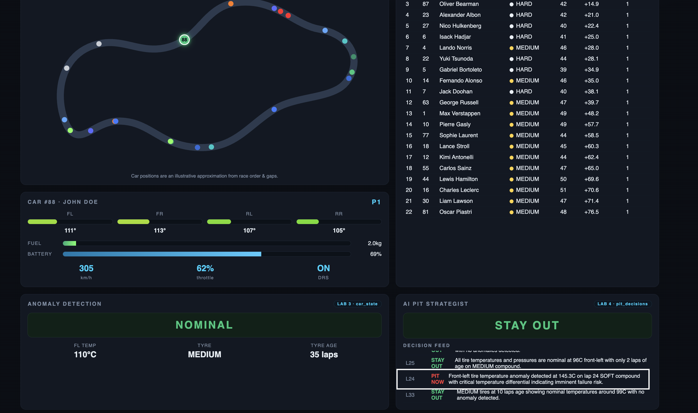

## Lab 5 — Query the Live Race with the Real-Time Context Engine (RTCE)

Now that `car_state` exists, we will wire an AI agent straight to the live streams through Confluent's **Real-Time Context Engine (RTCE)**.

**Enable RTCE in the Console.** RTCE is turned on per topic in the Confluent Cloud Console — nothing is pre-enabled for you. Enable it on the two topics you'll query, `car_telemetry` (the raw sensor stream) and `car_state` (the enriched output you just built):

1. Open the **[Topics](https://confluent.cloud/go/topics)** UI — it takes you straight to your cluster's topics.

    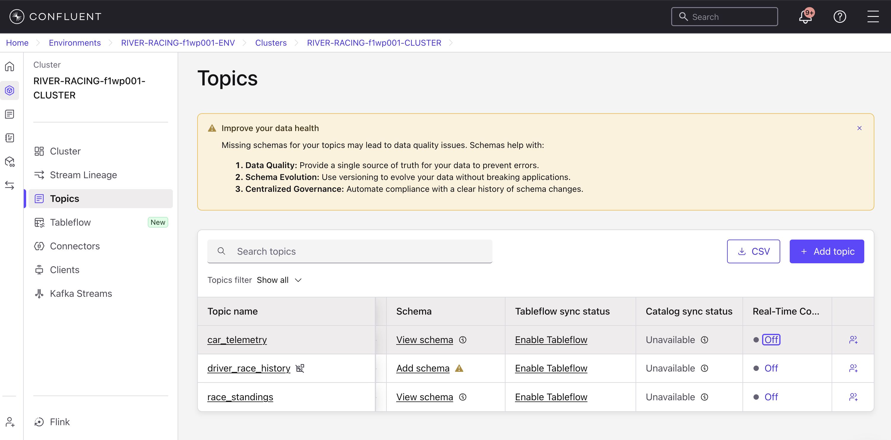

2. Go to the **Real-Time Context Engine** column for the `car_telemetry` topic and select **Off**.
3. Click **Turn on**.

    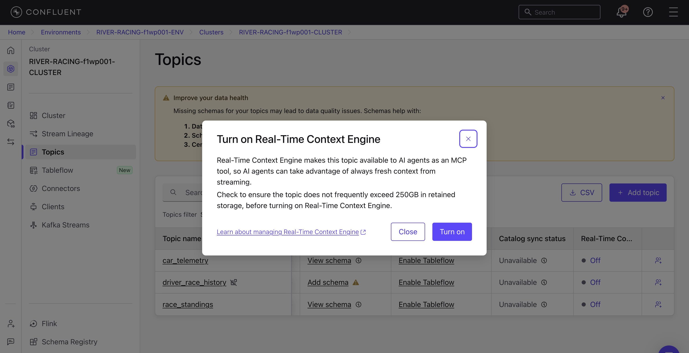

4. Repeat for **`car_state`**.

    > [!NOTE]
    > Enablement can take a few minutes per topic. Wait for it to show **On** before continuing.

**Connect your MCP client.** In a new terminal window, open the repo directory and run:

```bash
uv run setup-rtce
```

Choose Claude Code, Codex, or both. The script reads your credential file and configures the RTCE connection. Restart your coding agent afterward.

> [!NOTE]
> It can take 1-2 minutes to connect to RTCE. Run `/mcp` and check that `real-time-context-engine` shows as enabled/connected before asking about the live race.

**Ask about the live race.** Run `claude`, then try:

- `What topics do I have access to in the Real-Time Context Engine?` *(queries `listTopics`)*
- `What's the front-left tire temperature on car 88 right now?`
- `Show me the last 10 telemetry readings for car 88.`
- `Is car 88's front-left tire flagged as anomalous?` *(queries `car_state`)*

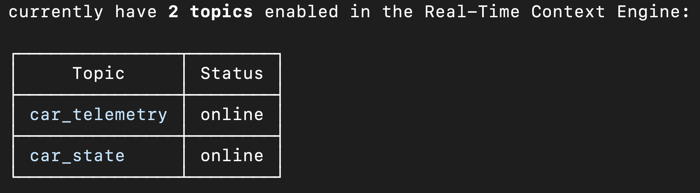

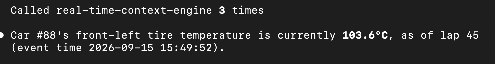

Three tools come with it — `listTopics`, `getMetadata`, `queryData` — and only RTCE-enabled topics are exposed. Enable more from the **Topics** page the same way you enabled these two.

## 🧩 Challenge #1 — Social Media Agent (Claude + Real-Time Context Engine)

Now, it's time to switch gears and take on the role of the social media team for River Racing. You've been given access to the live race data via RTCE and need to use AI to generate an engaging social media post. Based on what yuo've learned in the workshop, do the following: 

1. Enable RTCE on the `pit-decisions` table in the Confluent Cloud Console. 
2. Create a persona prompt for your agent to help it develop an engaging social media post. 
3. Have your agent draft a post using real time data from your MCP connection. 

Feel free to use one of the following prompts to draft your next post: 
- "We just made a big move — write a post celebrating it."
- "The pit wall just made a call. Draft a post about our strategy."
- "Write a 3-tweet recap thread of John's race so far."

**Success looks like:** Claude calls `queryData` against `car_state` and `pit_decisions` (you'll see the tool calls in the transcript) and returns a drafted post citing the real lap number, position, and strategy call from your live feed — not invented numbers. If it says the feed is quiet, the race may not be running yet, or RTCE isn't enabled on one of the two topics.

## 🧩 Challenge #2 — Analyze race data with Lightning Queries 

Now, we'll see how this real-time context becomes queryable with Lightning Tables and Lightning Queries. Lightning Queries read an RTCE-enabled topic over low-latency REST, so enable RTCE on `car_telemetry` in the Console first if you haven't already.

From the repo directory, print a ready-to-run query:

```bash
uv run setup-rtce --lightning
```

Copy the printed `curl` command into your terminal and run it. It returns the last 10 telemetry rows by lap; edit the SQL in `query` to filter for car 88 or select other columns. 

**Now, write a new SQL statement to perform analysis on the `pit_decisions` topic**. If you haven't already, make sure that `pit_decisions` has RTCE enabled in the Confluent Cloud Console. Then, edit the `curl` command and `query` provided above to get new insights on `pit_decisions` data. Feel free to get creative with the data! 


**← Back to Overview**: [Main README](../../README.md)