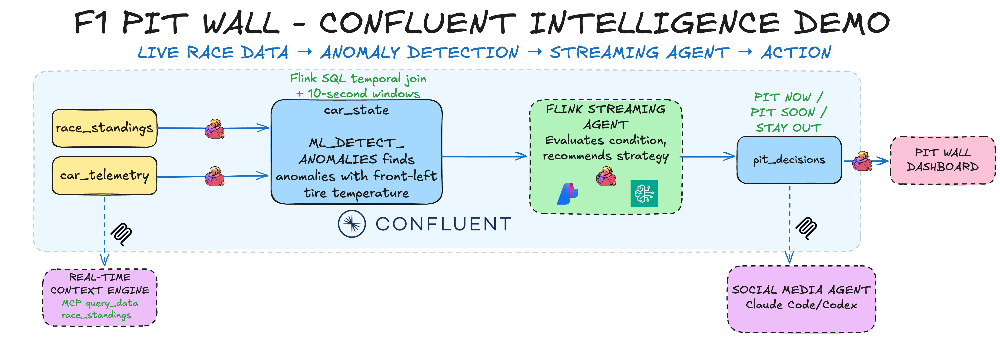
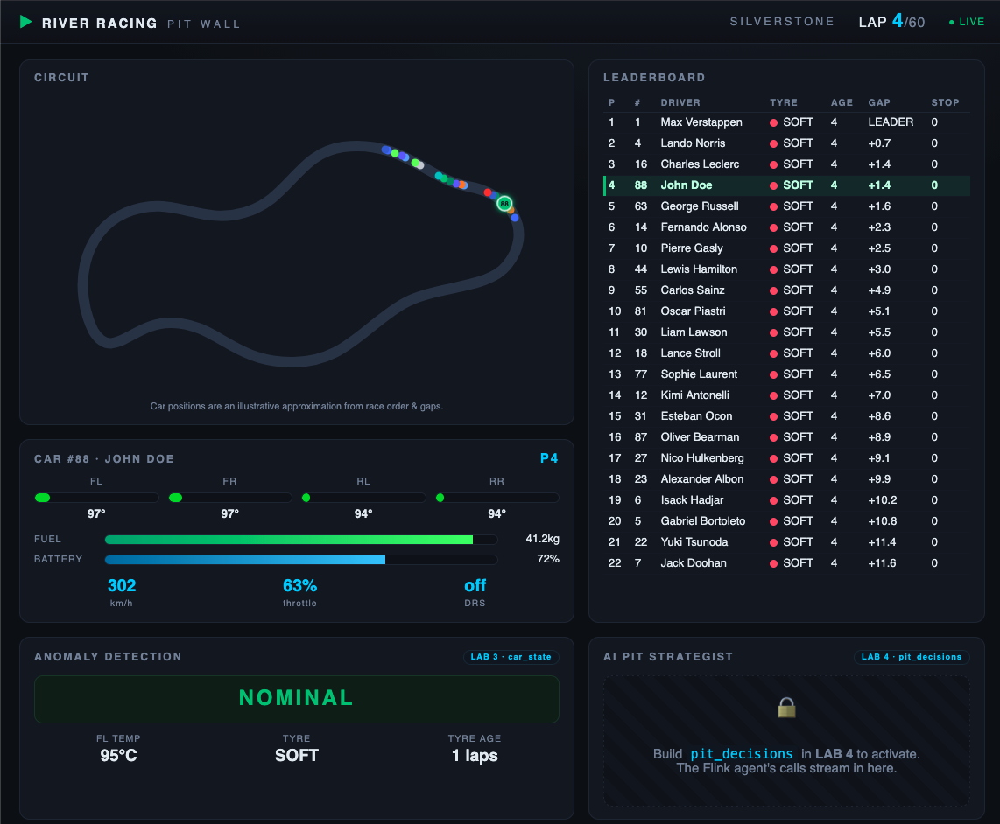
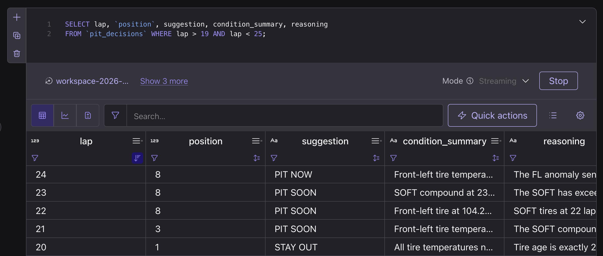
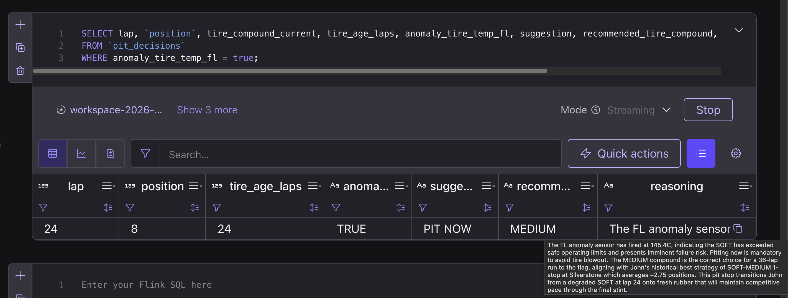
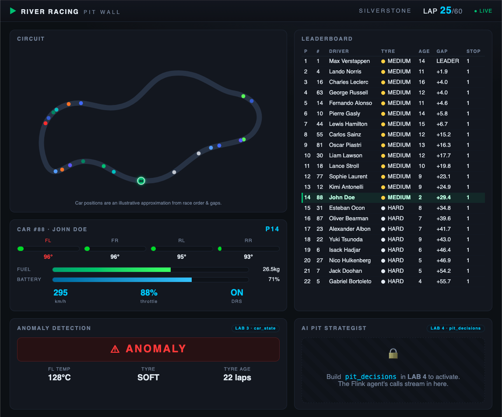
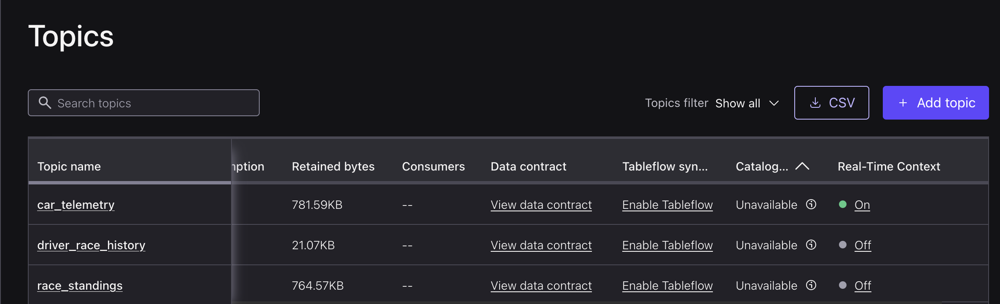
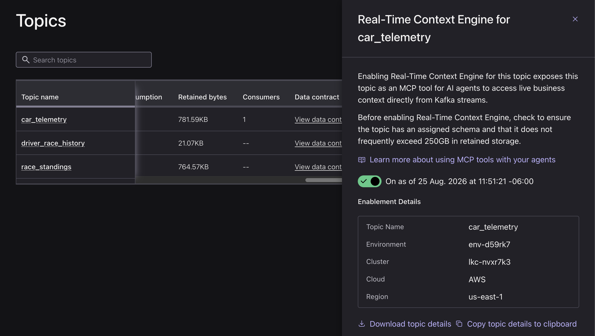

# Self-service workshop walkthrough



> [!NOTE]
>
> Use this path when you have your own Confluent Cloud login and password, and will provision your own environment. **If your instructor gave you a workshop login and password,** use the [hosted workshop walkthrough](./HOSTED-WORKSHOP.md).

## Before you start

You need a [Confluent Cloud account](https://confluent.cloud/signup), as well as AWS Bedrock API keys in `us-east-1` region - **your instructor will likely provide these.** If not, you can easily create them yourself with `uv run api-keys create` if you are logged into the AWS CLI.

## 1. Clone, install, and provision

`brew install` the prerequisites:

```bash
brew install git uv
brew tap hashicorp/tap
brew install hashicorp/tap/terraform
brew install --cask confluent-cli
```

Then, clone the repo:

```bash
git clone https://github.com/confluentinc/demo-confluent-intelligence-f1.git
cd demo-confluent-intelligence-f1
```

Sign into Confluent Cloud:

```bash
confluent login
```

Finally, provision the environment with the following command:

```bash
uv run selfservice up
```

The command asks for your Confluent credentials, email, and AWS Bedrock credentials. It writes an ignored credential card under `runs/selfservice/credentials/` and seeds 198 historical race rows.

Open the [SQL workspace](https://confluent.cloud/workspaces/) in the Confluent Cloud Console. Select `RIVER-RACING-DEMO-ENV` as the catalog and `RIVER-RACING-DEMO-CLUSTER` as the database. Confirm the setup:

## 2. Create `car_state` with `ML_DETECT_ANOMALIES`, then start the race

Paste this statement into one SQL cell and run it. Wait for it to show **Running**.

```sql
CREATE TABLE `car_state`
WITH ('changelog.mode' = 'append')
AS
WITH enriched AS (
  SELECT
    t.car_number, t.event_time, t.lap,
    t.tire_temp_fl_c, t.tire_temp_fr_c, t.tire_temp_rl_c, t.tire_temp_rr_c,
    t.tire_pressure_fl_psi, t.tire_pressure_fr_psi,
    t.tire_pressure_rl_psi, t.tire_pressure_rr_psi,
    t.engine_temp_c, t.brake_temp_fl_c, t.brake_temp_fr_c,
    t.battery_charge_pct, t.fuel_remaining_kg,
    r.`position`, r.gap_to_ahead_sec, r.gap_to_leader_sec,
    r.pit_stops, r.tire_compound, r.tire_age_laps
  FROM `car_telemetry` t
  JOIN `race_standings` FOR SYSTEM_TIME AS OF t.event_time AS r
    ON t.car_number = r.car_number
),
windowed AS (
  SELECT
    window_start, window_end, window_time, car_number,
    MAX(lap) AS lap,
    AVG(tire_temp_fl_c) AS tire_temp_fl_c,
    AVG(tire_temp_fr_c) AS tire_temp_fr_c,
    AVG(tire_temp_rl_c) AS tire_temp_rl_c,
    AVG(tire_temp_rr_c) AS tire_temp_rr_c,
    AVG(tire_pressure_fl_psi) AS tire_pressure_fl_psi,
    AVG(tire_pressure_fr_psi) AS tire_pressure_fr_psi,
    AVG(tire_pressure_rl_psi) AS tire_pressure_rl_psi,
    AVG(tire_pressure_rr_psi) AS tire_pressure_rr_psi,
    AVG(engine_temp_c) AS engine_temp_c,
    AVG(brake_temp_fl_c) AS brake_temp_fl_c,
    AVG(brake_temp_fr_c) AS brake_temp_fr_c,
    AVG(battery_charge_pct) AS battery_charge_pct,
    AVG(fuel_remaining_kg) AS fuel_remaining_kg,
    MAX(`position`) AS `position`,
    MAX(gap_to_ahead_sec) AS gap_to_ahead_sec,
    MAX(gap_to_leader_sec) AS gap_to_leader_sec,
    MAX(pit_stops) AS pit_stops,
    MAX(tire_compound) AS tire_compound,
    MAX(tire_age_laps) AS tire_age_laps
  FROM TABLE(
    TUMBLE(TABLE enriched, DESCRIPTOR(event_time), INTERVAL '20' SECOND)
  )
  GROUP BY window_start, window_end, window_time, car_number
),
anomaly AS (
  SELECT
    *,
    ML_DETECT_ANOMALIES(tire_temp_fl_c, window_time,
      JSON_OBJECT('minTrainingSize' VALUE 12,
                  'maxTrainingSize' VALUE 50,
                  'confidencePercentage' VALUE 99.99,
                  'enableStl' VALUE FALSE))
      OVER (PARTITION BY car_number ORDER BY window_time RANGE BETWEEN UNBOUNDED PRECEDING AND CURRENT ROW)
      AS anomaly_tire_temp_fl_result
  FROM windowed
)
SELECT
  car_number, lap,
  tire_temp_fl_c, tire_temp_fr_c, tire_temp_rl_c, tire_temp_rr_c,
  tire_pressure_fl_psi, tire_pressure_fr_psi,
  tire_pressure_rl_psi, tire_pressure_rr_psi,
  engine_temp_c, brake_temp_fl_c, brake_temp_fr_c,
  battery_charge_pct, fuel_remaining_kg,
  CASE
    WHEN anomaly_tire_temp_fl_result.is_anomaly
         AND anomaly_tire_temp_fl_result.actual_value
             > anomaly_tire_temp_fl_result.upper_bound
    THEN true
    ELSE false
  END AS anomaly_tire_temp_fl,
  `position`, gap_to_ahead_sec, gap_to_leader_sec,
  pit_stops, tire_compound, tire_age_laps
FROM anomaly
WHERE lap > 0;
```

Now start the local race in its own terminal:

```bash
uv run f1-race
```

Leave it running. `car_state` emits one row per 20-second window. After 12 windows it has enough history to detect temperature anomalies of the left front tire.

In a **second terminal**, open the Pit Wall dashboard:

```bash
uv run f1-pitwall
```

A browser opens at http://localhost:8000 with the Silverstone track map, the live leaderboard, and car #88's tyre/fuel gauges. The **ANOMALY DETECTION** and **AI PIT STRATEGIST** panels stay locked until `car_state` and `pit_decisions` exist:



Verify the stream in a new SQL cell:

```sql
SELECT car_number, lap, `position`, tire_compound, tire_age_laps, anomaly_tire_temp_fl, tire_temp_fl_c
FROM `car_state`;
```

## 2B. (Optional) Forecast tire temperature with Granite Time Series models

Run this only after `car_state` produces rows. Stop the query after you inspect the result so Lab 4 can use the compute pool.

This query uses IBM Granite **TinyTimeMixer** (`'model' VALUE 'ttm'`), a compact pre-trained time-series foundation model. You can swap the `model` value to try other built-in foundation forecasters; Google's TimesFM 2.5 is the default. See [Forecast Data Trends](https://docs.confluent.io/cloud/current/ai/builtin-functions/forecast.html) in the Confluent Cloud documentation.

```sql
WITH windowed AS (
  SELECT
    window_start,
    window_end,
    window_time,
    car_number,
    MAX(lap) AS lap,
    AVG(tire_temp_fl_c) AS tire_temp_fl_c
  FROM TABLE(
    TUMBLE(TABLE `car_telemetry`, DESCRIPTOR(event_time), INTERVAL '20' SECOND)
  )
  GROUP BY window_start, window_end, window_time, car_number
),
forecasted AS (
  SELECT
    *,
    AI_FORECAST(
      tire_temp_fl_c,
      window_time,
      JSON_OBJECT(
        'model' VALUE 'ttm',
        'horizon' VALUE 20,
        'minContextSize' VALUE 20,
        'maxContextSize' VALUE 50,
        'rmseWindowSize' VALUE 5
      )
    ) OVER (
      PARTITION BY car_number
      ORDER BY window_time
      RANGE BETWEEN UNBOUNDED PRECEDING AND CURRENT ROW
    ) AS forecast_result
  FROM windowed
)
SELECT
  lap,
  window_time AS forecast_generated_at,
  tire_temp_fl_c AS current_tire_temperature_c,
  forecast_result.forecast[1].`timestamp` AS next_point_at,
  forecast_result.forecast[1].mean AS next_point_c,
  forecast_result.forecast AS full_forecast,
  forecast_result.metadata AS forecast_metadata
FROM forecasted
WHERE CARDINALITY(forecast_result.forecast) > 0;
```

## 3. Create `pit_strategy_agent` to provide expert advice on when to do a pit stop

Paste and run the agent statement:

```sql
CREATE AGENT `pit_strategy_agent`
USING MODEL `llm_textgen_model`
USING PROMPT 'OUTPUT FORMAT — respond with exactly these 7 labeled lines in this order. No markdown, no asterisks, no bold, plain text only.

Suggestion: [PIT NOW | PIT SOON | STAY OUT]
Condition Summary: [one sentence describing current car condition]
Race Context: [one sentence on race situation based on competitor standings in the input]
Recommended Compound: [SOFT | MEDIUM | HARD | N/A if STAY OUT]
Recommended Stint Laps: [integer expected laps on new tires | N/A if STAY OUT]
Recommended Reason: [one sentence explaining compound choice | N/A if STAY OUT]
Reasoning: [2-4 sentences full explanation of your decision]

Correct STAY OUT example:
Suggestion: STAY OUT
Condition Summary: Front-left tire temperature is nominal at 107C with 18 laps of age on SOFT compound.
Race Context: Currently P3. No competitors in top 10 have pitted yet. Leader is 8.2s ahead.
Recommended Compound: N/A
Recommended Stint Laps: N/A
Recommended Reason: N/A
Reasoning: Tire temps and pressures are within normal operating windows for a SOFT at this age. Track position P3 is strong. Pitting now would surrender 4-6 seconds and drop John behind cars currently behind us.

Correct PIT NOW example:
Suggestion: PIT NOW
Condition Summary: Front-left tire temperature anomaly at 145C, 20C above expected upper bound — failure risk imminent.
Race Context: Currently P8. P4 and P5 already pitted 3 laps ago and are pushing on fresh mediums.
Recommended Compound: MEDIUM
Recommended Stint Laps: 36
Recommended Reason: Mediums will carry John to the flag across the remaining 36 laps and give him the pace to recover positions lost during the stop.
Reasoning: The FL anomaly flag indicates the SOFT has gone past its operating limit with blowout risk. Pitting now onto mediums avoids tire failure. Based on historical data, John averages +2.75 positions on SOFT-MEDIUM — this is his strongest strategy.

---

You are the AI pit wall strategist for River Racing at the 2026 British Grand Prix (Silverstone, 60 laps).
Driver: John Doe, Car #88.

DECISION ALGORITHM — apply these rules in order. Do not deviate.

Step 1: If anomaly_tire_temp_fl = true → Suggestion: PIT NOW. Stop.
Step 2: Else if pit_stops > 0 → Suggestion: STAY OUT. Stop.
Step 3: Else if tire_compound = SOFT AND tire_age_laps >= 21 → Suggestion: PIT SOON. Stop.
Step 4: Else → Suggestion: STAY OUT. Stop.

These rules are absolute. The race context, gap, competitor pit timing, and tire
temperatures are inputs FOR YOUR REASONING TEXT ONLY — they MUST NOT change the
Suggestion field. Reason about strategy in the Reasoning field, but the Suggestion
itself is fully determined by Steps 1–4 above.

FORBIDDEN PATTERNS — these are bugs, not options:
- Outputting PIT NOW when anomaly_tire_temp_fl = false. No exceptions.
- Outputting PIT SOON when tire_age_laps < 21.
- Outputting PIT SOON after pit_stops > 0.
- Outputting anything other than STAY OUT when tire_age_laps < 20 AND anomaly_tire_temp_fl = false.
- Justifying PIT NOW with phrases like "approaching cliff", "blowout risk", "tires near limit",
  "performance falling off" — these are PIT SOON or STAY OUT signals, never PIT NOW.

SELF-CHECK before responding: re-read Steps 1–4 with the actual input values.
The input includes REQUIRED SUGGESTION, computed by Flink SQL from those rules.
Copy that exact value into Suggestion. If your prose conflicts with it, fix the
prose before outputting.

COMPETITOR CONTEXT:
Current top-10 standings are provided at the end of each input. Use them to identify:
- Which competitors have already pitted (and are now on fresher rubber)
- Who is still on old tires and likely to pit soon
- Whether John is at risk of being undercut, or has an overcut opportunity

TIRE STRATEGY at Silverstone (60-lap race):
- SOFT: High-grip compound. Optimal window is laps 1-19. Still competitive laps 20-22 with some pace loss and position drops — but no failure risk unless the anomaly sensor fires. Performance cliff begins around lap 18-20.
- MEDIUM: Balanced compound, best for a 30-40 lap second stint after a SOFT first stint. Enables clean 1-stop strategy.
- HARD: Very durable but slow. Only consider if 40+ laps remain at the second stop.
- John Doe historical best: SOFT first stint → MEDIUM second stint (1-stop) averages +2.75 positions over 4 prior races. The pit wall warns at laps 21-23, calls PIT NOW only when the lap-24 anomaly fires, then lets the fresh MEDIUM stint run.

REMINDER: For any STAY OUT decision, write N/A for Recommended Compound, Recommended Stint Laps, and Recommended Reason.'
-- USING TOOLS `car_telemetry_tool`  -- uncomment when RTCE is active
WITH ('max_iterations' = '10');
```

Then, confirm that the agent is created and registered properly:

```sql
SHOW AGENTS;
```
## 4. Create `pit_decisions` table and invoke your Streaming Agent with `AI_RUN_AGENT`

Next we create the `pit_decisions` table, which holds the Streaming Agent's recommendations and output. As part of this command, we invoke the Streaming Agent using `AI_RUN_AGENT`. [See documentation for AI_RUN_AGENT here.](https://docs.confluent.io/cloud/current/flink/reference/functions/model-inference-functions.html#ai-run-agent)

```sql
CREATE TABLE `pit_decisions`
WITH ('changelog.mode' = 'append')
AS
SELECT
  cs.car_number,
  cs.lap,
  cs.`position`,
  cs.tire_compound AS tire_compound_current,
  cs.tire_age_laps,
  cs.anomaly_tire_temp_fl,
  CASE
    WHEN cs.anomaly_tire_temp_fl THEN 'PIT NOW'
    WHEN cs.pit_stops > 0 THEN 'STAY OUT'
    WHEN cs.tire_compound = 'SOFT' AND cs.tire_age_laps >= 21 THEN 'PIT SOON'
    ELSE 'STAY OUT'
  END AS suggestion,
  TRIM(REGEXP_EXTRACT(CAST(response AS STRING), '\*{0,2}Condition Summary:\*{0,2}\s*([^\n]+)', 1)) AS condition_summary,
  TRIM(REGEXP_EXTRACT(CAST(response AS STRING), '\*{0,2}Race Context:\*{0,2}\s*([^\n]+)', 1)) AS race_context,
  NULLIF(TRIM(REGEXP_EXTRACT(CAST(response AS STRING), '\*{0,2}Recommended Compound:\*{0,2}\s*([^\n]+)', 1)), 'N/A') AS recommended_tire_compound,
  CAST(NULLIF(TRIM(REGEXP_EXTRACT(CAST(response AS STRING), '\*{0,2}Recommended Stint Laps:\*{0,2}\s*([^\n]+)', 1)), 'N/A') AS INT) AS recommended_stint_laps,
  NULLIF(TRIM(REGEXP_EXTRACT(CAST(response AS STRING), '\*{0,2}Recommended Reason:\*{0,2}\s*([^\n]+)', 1)), 'N/A') AS recommended_reason,
  TRIM(REGEXP_EXTRACT(CAST(response AS STRING), '\*{0,2}Reasoning:\*{0,2}\s*([\s\S]+?)$', 1)) AS reasoning,
  CAST(response AS STRING) AS raw_response
FROM `car_state` /*+ OPTIONS('scan.startup.mode'='earliest-offset') */ cs,
LATERAL TABLE(AI_RUN_AGENT(
  `pit_strategy_agent`,
  CONCAT(
    'CAR STATE — Lap ', CAST(cs.lap AS STRING), ' of 60 | Silverstone British Grand Prix\n',
    'Driver: John Doe (#', CAST(cs.car_number AS STRING), ') | Current Position: P', CAST(cs.`position` AS STRING), '\n',
    'REQUIRED SUGGESTION — copy exactly: ',
    CASE
      WHEN cs.anomaly_tire_temp_fl THEN 'PIT NOW'
      WHEN cs.pit_stops > 0 THEN 'STAY OUT'
      WHEN cs.tire_compound = 'SOFT' AND cs.tire_age_laps >= 21 THEN 'PIT SOON'
      ELSE 'STAY OUT'
    END, '\n',
    '\nTIRE DATA:\n',
    '  Compound: ', cs.tire_compound, ' | Age: ', CAST(cs.tire_age_laps AS STRING), ' laps\n',
    '  FL Temp: ', CAST(ROUND(cs.tire_temp_fl_c, 1) AS STRING), 'C',
    '  FR: ', CAST(ROUND(cs.tire_temp_fr_c, 1) AS STRING), 'C',
    '  RL: ', CAST(ROUND(cs.tire_temp_rl_c, 1) AS STRING), 'C',
    '  RR: ', CAST(ROUND(cs.tire_temp_rr_c, 1) AS STRING), 'C\n',
    '  FL Pressure: ', CAST(ROUND(cs.tire_pressure_fl_psi, 1) AS STRING), 'psi',
    '  FR: ', CAST(ROUND(cs.tire_pressure_fr_psi, 1) AS STRING), 'psi',
    '  RL: ', CAST(ROUND(cs.tire_pressure_rl_psi, 1) AS STRING), 'psi',
    '  RR: ', CAST(ROUND(cs.tire_pressure_rr_psi, 1) AS STRING), 'psi\n',
    '  FL Tire Anomaly Detected: ', CAST(cs.anomaly_tire_temp_fl AS STRING), '\n',
    '\nCAR SYSTEMS:\n',
    '  Engine Temp: ', CAST(ROUND(cs.engine_temp_c, 1) AS STRING), 'C',
    '  Brake FL: ', CAST(ROUND(cs.brake_temp_fl_c, 1) AS STRING), 'C',
    '  Brake FR: ', CAST(ROUND(cs.brake_temp_fr_c, 1) AS STRING), 'C\n',
    '  Battery: ', CAST(ROUND(cs.battery_charge_pct, 1) AS STRING), '%',
    '  Fuel Remaining: ', CAST(ROUND(cs.fuel_remaining_kg, 1) AS STRING), 'kg\n',
    '\nRACE CONTEXT:\n',
    '  Gap to Leader: ', CAST(ROUND(cs.gap_to_leader_sec, 2) AS STRING), 's',
    '  Gap to Car Ahead: ', CAST(ROUND(cs.gap_to_ahead_sec, 2) AS STRING), 's\n',
    '  Pit Stops Taken: ', CAST(cs.pit_stops AS STRING), '\n',
    '  Laps Remaining: ', CAST(60 - cs.lap AS STRING)
  ),
  MAP['debug', 'true']
));
```

## 5. Inspect `pit_decisions`

```sql
SELECT lap, `position`, suggestion, condition_summary, reasoning
FROM `pit_decisions`;
```



```sql
SELECT lap, `position`, tire_compound_current, tire_age_laps,
       anomaly_tire_temp_fl, suggestion,
       recommended_tire_compound, recommended_stint_laps, reasoning
FROM `pit_decisions`
WHERE anomaly_tire_temp_fl = true;
```



> [!NOTE]
>
> At lap 24, the result should include the only `PIT NOW`, for the front-left tire anomaly. Laps 21–23 show `PIT SOON`; lap 25 returns to `STAY OUT` on fresh MEDIUMs. The Pit Wall unlocks its anomaly and AI strategist panels as the tables begin producing:




## 5A. (optional) Connect race feed to WatsonX Orchestrate

To run the local race-feed service for watsonx Orchestrate:

```bash
uv run f1-social-feed --creds runs/selfservice/credentials/DEMO.env
```

Expose port 8080 through an approved HTTPS tunnel, set `servers[0].url` in `docs/assets/orchestrate/f1-race-feed-openapi.json` to that public URL, and follow [Lab 5 in the hosted walkthrough](./HOSTED-WORKSHOP.md#lab-5-social-media-agent-ibm-watsonx-orchestrate).

## 6. (optional) Expose `car_telemetry` to AI agents with Real-Time Context Engine

Real-Time Context Engine (RTCE) exposes a Kafka topic as an MCP tool, so any MCP-compatible AI agent can query the topic. `uv run selfservice up` already enabled it on `car_telemetry` for you (Terraform's `enable_rtce`, default `true`) and minted an RTCE API key onto your credential card — there's nothing to toggle.

Point your coding agent at it in one command:

```bash
uv run setup-rtce
```

This registers RTCE as an MCP server with Claude Code (or prints a config snippet for Codex CLI), using the `F1_RTCE_MCP_ENDPOINT`/`F1_RTCE_API_KEY`/`F1_RTCE_API_SECRET` fields already on your card. Then just ask, in plain English: *"What are car 88's front-left tire temperatures over the last few laps?"*

If you'd rather confirm the toggle yourself, it's under your environment's cluster, **Topics** — `car_telemetry` shows Real-Time Context Engine already **On**:



The panel shows the enablement details — environment, cluster, cloud, and region — that an MCP client needs to reach it:



Once Real-Time Context Engine is enabled on `car_telemetry`, and you've run `uv run setup-rtce` to connect Claude or Codex, you can ask your LLM questions like:

- *At what lap in the race does the engine temperature peak?*
- *What is the front right tire temperature at lap 30?*

## Run the workshop again or tear it down

Stop `f1-race` with Ctrl-C when you finish. Use reset only when you intend to erase the race history and repeat the workshop from a clean slate:

```bash
uv run reset
```

After reset, recreate `car_state`, wait for it to show **Running**, then start `uv run f1-race` again.

When you're ready to tear down all resources associated with the lab, run:

```bash
uv run selfservice down
```

---

**← Back to Overview**: [Main README](../../README.md)
